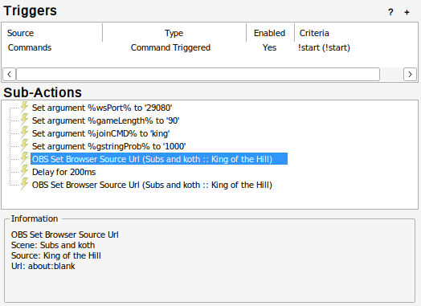
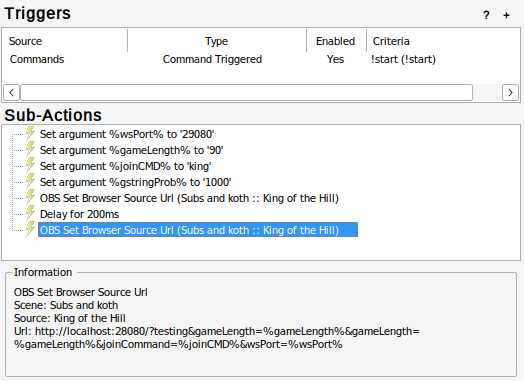
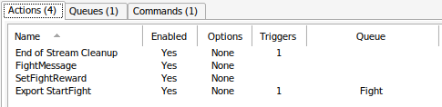
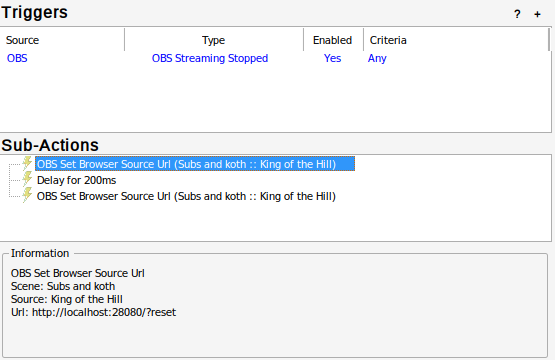

# Twitch King of the Hill


King of the Hill game for Twitch Streams to engage their audience.

A live example or a stable version you can use in production/live: [https://twitchbot.hankin.io/](https://twitchbot.hankin.io/). It can be modified to your liking using the url modification below.

To try out the weapons and different features go to  [https://twitchbot.hankin.io/testing](https://twitchbot.hankin.io/testing)

## Docker Container

Docker image: [ozyviking/twitch-king-of-the-hill](https://hub.docker.com/repository/docker/ozyviking/twitch-king-of-the-hill/)

### Images

- Stable: Built of tagged pushes that are either a patch, minor or major semver bump.
- Latest: More bleading edge / higher chance of bugs. Built off every push to github.
- Branch: Built off the latest push in that branch.
- Tags: Built off tagged pushes ('v0.1.1').
- Seasonal names: Halloween will be the latest Halloween build etc.

### Docker Compose

```bash
docker compose up -d
```

To change the port of the to container, default is 28080, change the user port in the `docker-compose.yaml` not the container port, i.e. change the `28080`, not the `80`.

```yaml
...
    ports:
      - 28080:80
...
```

### QNAP Conatainer Station

To set this container up on a QNAP, install Conatainer Station and then follow these steps:

1. Open Container station.
1. Click Create on the left.
1. Search 'twitch-king-of-the-hill'.
1. Select Docker Hub, you should see 'ozyviking/twitch-king-of-the-hill'.
1. Click install.
1. Change image version to stable (or your preference).
1. Click Advanced Settings.
1. Click 'network'.
1. Next to port forwarding click 'Add'.
1. Under 'Host' type '28080'.
1. Under 'Container' type '80'.
1. Click create.

You should be able to access the website on:

http://[QNAP IP addess]:28080/

### Resource Limiter

These values within the docker compose file are used to limit the resouces available. If the container isn't responding due to lag, I would suspent from large amount of traffic, try increasing either or both limits (or removing them for not limit).

```yaml
services:
  web:
    ...
    deploy:
      resources:
        limits:
          cpus: "2"
          memory: 2gb
    ...
```

## URLs

Currently there are:

- [King of the hill](https://github.com/Ozy-Viking/twitch_king_of_the_hill#king-of-the-hill)
- [Subs](https://github.com/Ozy-Viking/twitch_king_of_the_hill#stream-subs)
- [Counter](https://github.com/Ozy-Viking/twitch_king_of_the_hill#counter)

### King of the hill

King of the hill (KOTH)

```url
http://localhost:28080/
```

#### KOTH Streamer.bot Commands

All Commands, events and queues to import into streamer.bot.



Also included is a fight queue and `!start` command for testing.

```base64
U0JBRR+LCAAAAAAABADdWVtv20YWfi+w/0ErwH3qJHO/BAiK1Lttg7bbotnmpSiKMxfKbChS5SW2N8h/7yEp2ZYppo42F7d+kMU5Z0aH37l+5Kt/fLJYLF+musmrcvloIT4bFvL1pqrb51fLfFxe52W+7tbX60v6gD9gy600tYBrr/oLvCxhnXqVJ0WxaM/SIlTrNZSxGbVRAbr2rKp7le//d/nr8/xFXq6uhNcmLfkD+oBeCWJqQp1v2q3wm6o9W1Rlcbns5a9HSyLsWQKh125w5edxZbETDeI89gcpCoIqASRYrYnUURAXDScpaQhW6iyIsDNi2PZ7l7r+BsuuKG6upxJ8kfoz27pLe5KLUHQxfVlX66/zpq3qS1TKoGj2tHa4/buMiypbPGvrBOvFaZGg7DZ7FqzqCldQdW8VinO4bH7sykOH1+iBav0kbOGbyENVhq6uU9kekrZ1vlqhY24ieQvNQa/yzdMBVLr9Iwc+dn83jb/hDxq8A88coZZTIq21xFGaCGXGCGszEAImW9vLTY8dk5Tq27JZv0xQ6+U3xa+vL37ZQ3oaV4fQaEIq03+2Xn3W+WaBTli8wMCd2N9UXR2udL/BhOhDoM+er/OimKh3ddHrga+69pEvoHwxUUGHlmmwc/SIoMIzYz0xwXgiPdfEqmhIoMZZx5iJLsx4xAWqTRSCxCgzIkXgBIR2hAujbNIcomCTrecpX531wYQ5POMtYW8LdoF9K7Xu4Ma8jOmiL1h7/vvso7rnrG03jx4+LKoAxVnVtI+4pZY+/LxOTWrfp8O8MsEppwn1ClMo+kgs+ogkC0EHJpJX0xT6vxy2nBx3N3fRu7vrJRRD2eV0Yt4aLp5vpRPZWPgOFLUbeLkoBfc6IcoZfqgYifdWEa54MBayQMEegxejlL9rxNjdC9RX/U8NVWpPGKqigE2T4g35Tnztgmmj9InyzEWLUSUCFmZuiMXeSYJylFkWUoDsgzbKL3sHfJeaBlbpcH98U6Z+qH55TOdo00V/7vKkhvOn5aZrTybRsqlTltCA+CSEqhvMmITh6LcUMiGSkIRJx4jMPBAAyYjOuOegvMIqc1x0v/vyTT9adDuTWRMwnIXsx0DmKLHgEgFtk88Y1V6JDxrdz1I7BPiP6Rzq+PeK73q4p7HPYafCkMSB23nKiTQqEvDak+gylSIP1uo4nffytkj7GbLImwGH0zNYb9CIN3bo0ecaRORKRhIB00MaYYhTnpLgIToXjMrC9KfvkBmcqr9TahhsjcZhUwQFjkiZGMFyL4i3zjsdcP5j9GBqLB1ukMo6YqxQRDrc6TLEW9mMYp5xFrP9ne+MQ130PBY5FNRjFt3f/HlTnmyp85goMWGPVQbHcClwqhMGiZEHTzItOQgQNqk5TiUMsNTPghAT+oEmdB4ERjKhpMcyF2SQc5xKUnY8oxru/K9EqeZm9jY1LR7x6QrP+zaVq/bs8cn195PZ9d+qvDwdvfj4ZLj47l8nn543P2B4Pj4Z/0+b+zvkAklLjVMbI55nlkhtcWozXBGLQ0Hf/jWDdF/Im34bNlDn/ZE7/15jPrmZHXFwk1uBrq3+O97OQbMGAK3NNOUARMQee8Y58TQTJDOQANmB1dwdNT5x8X65wcclvx/o2YTBqHbMO6Kdx+GWp0R8VIZELgyT1rPI7gnVlfeD6hrtXFScMGpwzIXkCTBs7VRoKlmwHJncfaG66vhysK20s7VgefOZ85X0TvVAG2oj1gQihMJpKOlAbNSWGACfdAQfQd+TevAWD8Mm9bTBGaVc/VBXfhZE9PlxJZVyTGgwmKoi4jiiOA4mFGkpd5obJyjXPrsnEIrjIRyb+yx63OFgcRx8SgFjyOWNyALO4z4R67HwWZN57rWW0t4X+N4zaRm/7PRH3vEnr3vempJ4nAWHajHlJHsPopZzVl29/5qxa+yvk9GXzqC1SfU6b9sUf2oOMIgl05pqTCG5/LP9M4DnR5GNKyz+2fSca4bUTYhQXg6s7gC26yrebnI7JGd+pp/Zt3Rsb1e+Kqs6fVG110/KpnYMOk/LNtUlFIc0Nv17yaY97U9I9WHKtxPRAxt7b71hc3ct7l3y6vXeydCkZ6ls8jZ/mQ7tXhWVh+K0qopYnU8AGM++krG9nQdfJa5wlGi3dYjOxXWbr3ePgPoVFL/+A053hyxWHgAA
```

#### Modifications

To have multiple modifications, simply use an `&` between terms.

```url
http://localhost:28080/?wsPort=8080&gameLength=60
```

The values that are in each example are the default and are not required to be added. Except for the 'Streamer.bot Server' example.

Available:

- [Champion Name](https://github.com/Ozy-Viking/twitch_king_of_the_hill#champion-title-and-hill-name)
- [G-string Probability](https://github.com/Ozy-Viking/twitch_king_of_the_hill#probability-of-sexy-thong)
- [Game Length](https://github.com/Ozy-Viking/twitch_king_of_the_hill#game-length)
- [Hill Choice](https://github.com/Ozy-Viking/twitch_king_of_the_hill#hill-choice)
- [Hill Name](https://github.com/Ozy-Viking/twitch_king_of_the_hill#champion-title-and-hill-name)
- [Join Command](https://github.com/Ozy-Viking/twitch_king_of_the_hill#join-command)
- [Mass Testing](https://github.com/Ozy-Viking/twitch_king_of_the_hill#mass-testing)
- [Reset Winner History](https://github.com/Ozy-Viking/twitch_king_of_the_hill#reset-winner-history)
- [Rigged Users](https://github.com/Ozy-Viking/twitch_king_of_the_hill#additional-rigged-users)
- [Show Last Winner](https://github.com/Ozy-Viking/twitch_king_of_the_hill#show-last-winner)
- [Streamer.bot botID](https://github.com/Ozy-Viking/twitch_king_of_the_hill#streamerbot-botid)
- [Streamer.bot Server](https://github.com/Ozy-Viking/twitch_king_of_the_hill#streamerbot-server)
- [Streamer.bot Websocket Port](https://github.com/Ozy-Viking/twitch_king_of_the_hill#streamerbot-webstream-port)
- [Testing](https://github.com/Ozy-Viking/twitch_king_of_the_hill#testing-setup)
- [Win Streak Order](https://github.com/Ozy-Viking/twitch_king_of_the_hill#win-streak-order)
- [Win Streak](https://github.com/Ozy-Viking/twitch_king_of_the_hill#win-streak)
- [Winner limit](https://github.com/Ozy-Viking/twitch_king_of_the_hill#winner-limit)

##### Streamer.bot webstream port

To change the port to what the streamer bot is listening on, change it by search parameters in the url.

```url
http://localhost:28080/?wsPort=8080
```

wsPort: Websocket port of streamer bot set in streamer bot. Default is 8080.

##### Streamer.bot Server

If streamer.bot is on a different server to you gaming machine use the search parameter `server`. Change the webstream port as well if it is not on the default 8080.

```url
http://localhost:28080/?server=192.168.0.10
```

##### Streamer.bot BotID

Set botID for the streamer.bot connection, only applicable when multiple different bots are accessing like koth and others. Any alphanumeric text is fine.

```url
http://localhost:28080/?botID=123
```

##### Join Command

To change the join command from fight use the search parameter `joinCommand`. There is no issue if you want to use and exclamation command (!join) or not.

```url
http://localhost:28080/?joinCommand=fight
```

##### Game Length

To change the game length from 60 seconds use the search parameter `gameLength`.

```url
http://localhost:28080/?gameLength=60
```

##### Champion title and Hill name

This will replace the default "King of the Hill" to `[championName] of the [hillName]`.

```url
http://localhost:28080/?championName=King&hillName=Hill
```

##### Probability of Sexy Thong

Probability of a thong (flip flop) being a thong (g-string) (1 in x), use `gstringProb`. Default is 1,000 i.e. 1/1,000.

```url
http://localhost:28080/?gstringProb=1000
```

##### Additional Rigged Users

If you want to add an additional rigged user use the search parameter `riggedUser`. You can add as many as you would like.

```url
http://localhost:28080/?riggedUser=Ozy_Viking&riggedUser=Not_Ozy_Viking
```

##### Testing Setup

If you want a bunch of random players to jump in for testing, use `testing=true`.

```url
http://localhost:28080/?testing=true
```

or

```url
http://localhost:28080/?testing
```

##### Mass Testing

To get the battle to repeat constantly for testing, use `massTesting=true` or `massTesting`.

```url
http://localhost:28080/?massTesting
```

##### Show Last Winner

By default the last winner will be displayed, to not show them use the search parametre `lastWinner`.

```url
http://localhost:28080/?lastWinner=no
http://localhost:28080/?lastWinner=false
```


##### Win Streak

By default the win streaks will be sent through to twitch chat, to not have them, use the search parameter `winStreak`. Currently every 2 wins.

```url
http://localhost:28080/?winStreak=no
http://localhost:28080/?winStreak=false
http://localhost:28080/?winStreak=0
```

When you supply a number, that will be what the win streak is set to, to win.

```url
http://localhost:28080/?winStreak=2
```

##### Winner Limit

This limits the number of winners per stream (NOTE: Only for consecutive currently). Default: Infinity

```url
http://localhost:28080/?winner=1
```

##### Win Streak Order

This is to set whether the win streak is consecutive only or any wins per stream. Default: Consecutive.

###### Consecutive

This is the default setting.

```url
http://localhost:28080/
http://localhost:28080/?consecutive
```

###### Any Order

Use any of the 3 options below:

```url
http://localhost:28080/?consecutive=no
http://localhost:28080/?consecutive=false
http://localhost:28080/?consecutive=any
```

###### Both

Use any of the 3 options below:

```url
http://localhost:28080/?consecutive=both
http://localhost:28080/?consecutive=either
http://localhost:28080/?consecutive=all
```

##### Reset Winner History

To reset/clear the win history use the search parameter `reset`.

```url
http://localhost:28080/?reset
http://localhost:28080/?reset=true
```

To not reset either don't add it or equal it to either `false` or `no`.

```url
http://localhost:28080/
http://localhost:28080/?reset=false
http://localhost:28080/?reset=no
```

If you are using streamer.bot you can use:

```base64
U0JBRR+LCAAAAAAABADFVVtr2zAUfh/sP4g8V6ls+SLnZYyxrWOwQQvdwxhDtySmspTJctus9L9P8iWN4xTCLswPBn3f0dHx9x0dP7x8AcDsVtq6NHq2APisBcpqY6y73sFxB1elLqumesJnaB7Po1nPSkc99hAWfqlpJUPIpaylA19KDS7K2hm77cJ9BG3c2tgQ8/nn9vt1eVPq1Y58qmkWzdEc7Qgha27LjevJNn0N3FqCO3/GujsDUNdCUgtglmBrGgtqZyWt5rOQ57ErWdBRyZSHrLVHvnYIGKiWLkU4MEUUoxRTyEmWwSQTGBYij6GUGeUkyZYc86HYdtuPRjZBCd0otY9LTZmSIaezjRwx91w1Qr6zpho0W4AlVfUoahD4bfeNV+3ngTdKUt1sRhWsrPGIDx2hVN3RbX3Z6GPJLdXCVK95L/OE50bzxlqp3THW2XK18gbuK3mgZhtnWP2hFRX1DzzyGp794vf8QJwVlEUFRCRGMCGEwAIhCVGU55iQJcWYTra67SZoFyUIZYfcs75MVAv8Pv34tPg2UnraV8fUqLnU8lPv6lXDauBNADfGrSf1176h+S72o784oQVCx1+USk3CG6tCHGWmcQumqL6ZhHhDtWzr7BzBCLMoJwzmPGcwYXEGSSpyyFFekCKKclHwZxwpOMpygTEUIlnCBPMYUpwVMMZ5SmQWU4GjydY7Wa7WoZn8XX/GLUwOiaGxD67WCTaWWsj7MNlG/p39V3vWzm0W5+fKcKrWpnaLmCCCzl/ZMOL+pWEszXmRFhlELPVXSDABifcISkJ5xiMsWTq9Qn9k2GyS7jS70Ol23VLVjt0YTcqr6P11z064bvAdGWp7ehUiwTHLpFd56V+pEJAxksI4jXlO6JIjSn5Hrwih+G8rFp0+oN6Ho9opNSK5UYpuain2+IHuEw7x3b9ulMJvryqv6Rh0ZdX/HtpUPs3jLzYO1M+LCAAA
```


> **Note**: The second OBS set browser source url goes to `about:blank`. Modify the delay as required to ensure that it actually clears the storage before setting it to `about:blank`.

Set the url to the correct reset url. This sub-action auto resets your history when and only when you press **end stream** in OBS.

##### Hill Choice

The hill can be set by using the search param `hillChoice`.

```url
http://localhost:28080/?hillChoice=h2
```

Current Choices:

- default: Grassy Hill (no need to add)
- h1: Halloween 1
- h2: Halloween 2

##### List Weapon Choices

List the active weapon choises by using the parametre `listWeapons`.

```url
http://localhost:28080/?listWeapons=true
```

or

```url
http://localhost:28080/?listWeapons
```

The output will be logged to the console. Access it by pressing ctrl + shift + c and then either pressing escape until it shows or clicking the second tab in the devtools and choosing console.

Example output from v0.8.1:

```text
Type one of the following weapons to use them:
- teapot
- number 1 fan finger
- plunger
- doughnut
- thong
- giant match
- frying pan
- butchered name
- boomerang
- didgeridoo
- sausage sanga
- goon sack
- poop
- nuke
- 200 IQ
- rocket launcher
- cat o' 9 tail
- love
- cat litter
- mad house
- 90 belt
- Sassy's Ring
- lazy bot
- spaghetti
- combat
- combat wombat
```

#### Weapon Calls

This is an example of the setup for a weapon.

```js
'thong': {
        'file': 'thong.png',
        'left': 'transform: rotate(30deg) translate(10px,-60px)',
        'right': 'transform: rotate(-30deg) translate(-10px,-60px)',
        'command': ['thong', 'flip flop', 'formal thong', 'safety boot']
    },
```

- The display name is what will be displayed to the end user i.e. 'number 1 fan finger' is the name of the object. This is auto added as the name in the object i.e. weapon.name.
- file: the name of the picture within the images folder (`./static/images`).
- left: This is the CSS used when entering from the left.
- right: This is the CSS used when entering from the right.
- command: These are the smallest parts, that a user can declare so the system can recognise what they want. Regex is used and the must be in lowercase otherwise they will never be used. Note: if pan is used then no command with pan is usable. If you want to add a command as a priority over another weapons use of it, have that weapon declared higher in the code.

> If you want to flip/invert the image, use `scaleX(-1)`.

Use:

```text
{joinCommand} with an amazing FOrmaL ThoNG
```

Caps does not matter for the user.

For Doughnut, both american and british spelling were added. I highly recommend doing so for any other ambiguities.

#### Ideas

1. [ ] Kill messages on the top left like COD.
1. [ ] Make some weapons throwable.
1. [ ] Confetti explosion on win.
1. [x] Add crown to last winner.
1. [x] Drop down top.
2. [ ] Preload all current users images.

#### Known Bugs

1. [x] What bugs, please let me know by raising an issue.

#### Videos

- https://www.youtube.com/watch?v=VzQjQVTmSwQ
- https://www.youtube.com/watch?v=NO3Vl7nApgc

#### Acknowlegements

Inspired as a birthday gift for Ostrogothia (https://twitch.tv/Ostrogothia).
Original author is VRFlad: [Champion of the Hill](https://vrflad.com/champion)

#### Pictures

Special thanks to @the_rubble and @JDPlays for designing the new imagery!!! The rest are from vrflad's orginal game.

#### Sound

This game uses these sounds from [freesound.org](freesound.org).

Battle sounds mixed from:

- https://freesound.org/people/madmanmusic/sounds/347981/
- https://freesound.org/people/freefire66/sounds/175950/
- https://freesound.org/people/klavo1985/sounds/349382/

War horn from:

- https://freesound.org/people/DeVern/sounds/512490/

Yeet sounds from:

- https://freesound.org/people/unfa/sounds/588557/
- https://freesound.org/people/Alivvie/sounds/555627/
- https://freesound.org/people/hisoul/sounds/520275/
- https://freesound.org/people/hisoul/sounds/520268/

Cheer from:

- https://freesound.org/people/BeeProductive/sounds/430046/

---

### Stream Subs

```url
http://localhost:28080/subs
```

#### OBS Setting

Browser:

- Width: 400
- Height: 100

#### Streambot import function

```text
U0JBRR+LCAAAAAAABADNV9uO2zYQfS/Qf3ANpE/hgqQuJPOWprctsm2xafalKApeRl4hurgUtZcu9t9LSpZtWXLgbpMm+7TmGc6Q58wMRw9ffrFYLG/ANnldLV8soufdQl6ua+uutsu0Xy7zKi/bcre+xGf0jCw3KDjp1x7CD/+zkiUEk4v7xXd3wV1v5hHZuuvaBuyXv+//vMrf5dVqC+7OsiRneHDuAQONtvnabcBlWH7sIxs5iix1MGr8yu/9ymKAOjg3Yb+giqsMM2RMEqM4jiSSmlIksWQYR0JLrobY3ba/WmjDhaq2KPbXoZKqgODT2RZGyJ0uWgPf27r8MW9cbe+9USaLZmQ18HQJDbjFm1aFayqwC123lRsdYWXrdh1sd1Y/fTuykMWtvG8u22oukpWVqcuXekPhBNd1pVtrwUedQZ3NVysvzj6tB9RuvJSlD3TesZwqakyaGsQFTlCMARCngqNEGJpiTzGXcv8CewJxGnFCRIpoFAQyLENCiQRhRhkFoVSWTLe6+3UgM8bkEDkq0zxv+/jj7scfI7KneTZHSKOhgp83KgflFp6exbvaXU+O39St1SPbiUlri4A9azz49vL1s69tyJuJmdeygu58vRARjhRhXCGmmUKxoiniiWFIYya4IIQZoY8IYUycZQQbFDNfLjGOCeJAY5Qwg8FglsgIJltvIV9dhzzCZ/iISBE/BIb8PiixE/TLKwN3HiMj3Z5/Olk+qiAs4gkTGEUkARRzghFPsUbMKKYzLjiPk89FkOh0QW5k0TVYQpNDb6W8u9qgk8P3XW2mY+0xRjSRkkiBsASfwpoAUhGWviuJmOmYZ1LipzBGMKYfnjN6OmcO7tz28XixOJ5+awsZ+N5uXur+XZlhsudKsySGJFFI+T8UQ0RD8yaeMEIikyaZzujTuPrwTMX/oty7Gp679o20eQg21PeGwymFYTJp3NFD+QHF5ZUMJX61cfk+dwYy2RZuyOs5EnpBMs4zjplGKWGh/1KvhYgzFEdcKkOpiPT0ITxFEDp5JLcDxsTfaXrg05/NH0Ko7u0cgbouCrluwOzhA7wTeDrORZnPTwGZ74mMoJgKg0TCuJ82Uk60wlwL+r+Oc/6VuICmkSuYH+E+xdj2lOll6DDPrLw9r9at+y+9JfK5ykxCEDHUpzLPNBJ+qEPdiMGYMsDTz6W3fORc7v8Z7Pt0HLkYBumj3zF9R5sIiI8c1bevMne+fb1t5tJhC+8Ou+91eVEbsNJn/cHss/ctcohcnf/aLI+cJn/S58G2urqh10d+FfIN7HK+gifFkFddCc8Ud1mbw8dhECDE+6oL6Fv5KFJRa7mpytHGfFXVFr6p3a4gDuP1Jufh8JUsZgw2r81wwdm6HyA8szGo/J7N7Q4OWj88jjzLBt5A1eQuv4G53auiVrJ4VdeFqW8n1+99z2Pz/W/le5z7ra9lfKxEXF4OiRtWPPz4DxULYbu/EAAA
```

Ensure you set a Persistent Global Variable called subsURL.

#### Subs Setting

In the chat use `!setsubcount 10` this will set the count to 10 or if you know the tier amounts you can use `!setsubcount 0 2 1`. Only streamer and myself can do that.

#### Subs Modifications

##### Subs Streamer.bot webstream port

To change the port to what the streamer bot is listening on, change it by search parameters in the url.

```url
http://localhost:28080/subs?wsPort=8080
```

wsPort: Websocket port of streamer bot set in streamer bot. Default is 8080.

##### Subs Streamer.bot Server

If streamer.bot is on a different server to you gaming machine use the search parameter `server`. Change the webstream port aswell if it is not on the default 8080.

```url
http://localhost:28080/subs?server=127.0.0.1
```

##### Subs Reset Count

You can either use the pre-configured command `!resetsubs` or add reset to the search parameter/s.

```url
http://localhost:28080/subs?reset
```

##### Subs Testing

This will add buttons so you can manually simulate subs and reset count.

```url
http://localhost:28080/subs?testing
```

---

### Counter

```url
http://localhost:28080/counter
```

Counter is used for counting a specific message sent through chat. It uses a check to see if the message starts with a 'count command'. For example, if the command is '!slap' then as long as the first 5 characters start with '!slap' then it will increase the count.

#### Counter Command for streamerbot

```base64
U0JBRR+LCAAAAAAABADVVtuO2zYQfQ+Qf3D9HHqpmyUGKIo0QNu8tEG23ZeiMIbkyCYiiS5FrddZ7L+X1GVtWXKxCFqgfRGgOXMhz+EM+fj61WKxvEdTK10t3y6iN61BlXtt7N2zOezMpapU2ZQn+5KuwlWw7FG04GyP/sf9VlCid/mENdrFe91U/luWUMkuwPlAY3faeK9fvhw3d+qzqrbP4GlVy2BFV/QZkFgLo/a2B5fe/NStQcJoDSC8U+0sv3eWxQC1sJI+PslZlmeQkFTEAYkzuiaZZIKkQc4TZBCxIBtqt2F/Ntj4rVVNUZzbsQJeoM9pTYMj5EEUjcQfjC5/UrXV5uiccijqkdfAmPGMtYSNym6Nbvbths+tUBzgWH9qqrmMxpGty3eip2qCC12Jxhh0lWZQa9R260Q4p++Cwj5Lq+qHlk2+zrM0SCSRnEUkTigQlsRA1hHEjmWZr8PgfANnQnAexgDrlERAKYmRSgKICYEEIaAiiHkkJqH2uPekxTS4RK7KMc/bOf50+vljRPb0PM0RUgus8OdezduG1wtHz+KztrvJ8mvdGPHs24qOZnFbwL6e+Dam8E47a/f125sb/eVI7tuWWW2V3TV8pfSNPSgrdhtv3eh8Y3e42amiuBFd5u/aszXJ7M5Bhe3eOhEjGvEgzbhriZSTmIeuJRKZEkFTlrEgSF1/XBExpJS7jgES0jB1+rOUQAiUyJzKNBZRIthU/wOq7c6fQdfmVwSOsktg6IeLNnyB9qqS+OCrjTR/8z+V9FB/dMP625DRjP6bygY5wzXmQIRIQhKv89Ap6xo1S3LOGQMnMPuvKBu+XNl7KNppHtDJAkt4uOvRCdaN1pmxecZYHodpziLXC5BkJI5YSBgNMzffMFojxIIH0dcw5pYa/vOcBS+fgD/6Yu0YHIFCF/6UozzDB7hPOPh3l+goxXCPXL2uu8aaTF96Zal7NKWyFuVvdX+JzcNXNqO+6jqbe/aM8JMWk/tWVe0rYeb9UGp5eQgHtnytb9qpLia1Ci2gv/pHoWpbaYPfa/tOdEHTip3LBz9gKihmHPb+dVbbfrzNPy4GiM4EelH+Jrg5wV6ax6dRZqjxFqtaWXWPc9HbQnMo3mtdSH2YbL/LPY/NP7K2rtvtr13z0Wsn2qpyOGfti/T1q6e/AJ6d18pfCwAA
```

#### Counter Setting

In the chat use `!setcount 10` this will set the count to 10. Only streamer and myself can do that.

#### Counter Modifications

##### Counter Streamer.bot webstream port

To change the port to what the streamer bot is listening on, change it by search parameters in the URL.

```url
http://localhost:28080/counter?wsPort=8080
```

wsPort: Websocket port of streamer bot set in streamer bot. Default is 8080.

##### Counter Streamer.bot Server

If streamer.bot is on a different server to you gaming machine use the search parameter `server`. Change the webstream port as well if it is not on the default 8080.

```url
http://localhost:28080/counter?server=127.0.0.1
```

##### Counter Reset Count

You can either use the preconfigured command `!resetcount or add reset to the search parameter/s.

```url
http://localhost:28080/counter?reset
```

##### Counter Testing

This will add buttons so you can manually simulate the command and reset the count.

```url
http://localhost:28080/counter?testing
```

You can also add optional text to test as a message.

```url
http://localhost:28080/counter?testing=random text to test
```

##### Count Command

To change the count command from !slap use the search parameter `count`. There is no issue if you want to use and exclamation command (!slap) or not. The command is also, case insensative i.e. `!SLaPYA` is valid as it starts with !slap.

```url
http://localhost:28080/counter?count=!slap
```

##### Count Text

To change the text preceding the count use `counter_text`. There is a space between the counter text and the count but add and punctuation marks as needed. `Incoming Sassy Slaps:` is the default but also a valid input.

```url
http://localhost:28080/counter?counter_text=Incoming Sassy Slaps:
```

##### Count Timeout

To stop over spamming or helping prevent multiple people using the command for the same instance use the search parameter `timeout`. If no timeout is given, all inputs are counted. Only use numbers of seconds. For a 10 second timeout, `timeout=10` would be used. If `timeout=10sec` is used then the timeout will be 0.

```url
http://localhost:28080/counter?timeout=0
```

## Testing

To rebuid and test changes use the docker compose yaml in the testing folder. Ensure that the other container is down otherwith you will have conflicting ports.

```bash
docker compose --file ./testing/docker-compose.yaml up -d --force-recreate
```
